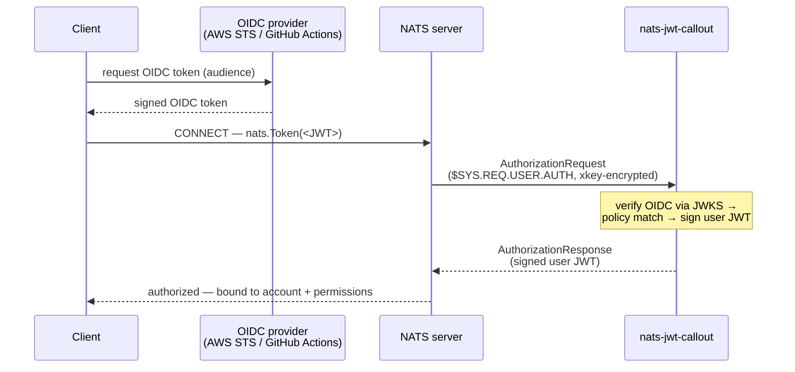

# nats-jwt-callout

A [NATS auth callout](https://docs.nats.io/running-a-nats-service/configuration/securing_nats/auth_callout)
service that authenticates NATS clients using **OIDC tokens** from any trusted
issuer — including **AWS Web Identity Tokens** (STS
[`GetWebIdentityToken`](https://docs.aws.amazon.com/STS/latest/APIReference/API_GetWebIdentityToken.html),
AWS *outbound web identity federation*) and **GitHub Actions** OIDC tokens.

A client obtains a short-lived, signed OIDC token for its identity and passes it
as the NATS connection token. This service verifies the token against the
issuer's published JWKS, maps the identity to a NATS account and permissions via
a policy file (matching on arbitrary verified claims), and returns a signed NATS
user JWT.

## How it works



1. The client obtains an OIDC token (e.g.
   `aws sts get-web-identity-token --audience <aud> --signing-algorithm RS256`,
   or a GitHub Actions ID token) and connects with it (`nats.Token(jwt)`).
2. The NATS server delegates auth to this service over `$SYS.REQ.USER.AUTH`
   (encrypted with an xkey).
3. The service:
   - selects a **trusted issuer** by exact `iss` match (never discovers an
     unconfigured issuer),
   - verifies the signature against the issuer's JWKS with a **signing-algorithm
     allowlist**, plus `exp`/`nbf` and an explicit **audience allowlist**,
   - binds the issuer to **required claim values** (`require_claims`),
   - evaluates the **policy** (ordered rules over `issuer`, `sub`, and arbitrary
     flattened `claims`) to pick a NATS account + permissions,
   - issues a user JWT bound to the server-supplied user nkey, with its expiry
     capped to the token's expiry.

## Build / install

```sh
go build ./cmd/nats-jwt-callout
# or download a release archive / container image (ghcr.io/sylr/nats-jwt-callout)
```

**Packages (deb/rpm).** Releases also ship `.deb` and `.rpm` packages that install
the binary to `/usr/bin`, a **systemd unit** to `/usr/lib/systemd/system/nats-jwt-callout.service`,
and config templates to `/etc/nats-jwt-callout/{config,policy}.yaml` (preserved on
upgrade). They create a `nats-jwt-callout` system user; the service is **not**
auto-started — edit the config first, then:

```sh
sudo systemctl enable --now nats-jwt-callout
```

## Configure

Generate the keys the server and service share (using the NATS `nk` tool). With
`-pubout`, `nk -gen` prints **two lines**: the seed first, then its public key.

```sh
go install github.com/nats-io/nkeys/nk@latest   # install the nk tool

nk -gen account -pubout   # line 1: account seed (SA…)  → issuer_account_seed
                          # line 2: account public (A…) → auth_callout.issuer
nk -gen curve -pubout     # line 1: curve seed   (SX…)  → xkey_seed
                          # line 2: curve public (X…)   → auth_callout.xkey
```

To derive the public key from a seed you already have (e.g. one stored in your
secret store), feed the seed back in with `-inkey … -pubout`:

```sh
printf '%s' "$ISSUER_ACCOUNT_SEED" > account.seed
nk -inkey account.seed -pubout    # → account public key (A…)
```

- Put the **public** account key in the server's `auth_callout.issuer` and the
  **public** curve key in `auth_callout.xkey` (see [`examples/server.conf`](examples/server.conf)).
- Put the corresponding **seeds** in the service config `issuer_account_seed` /
  `xkey_seed` (see [`examples/config.yaml`](examples/config.yaml)). Keep seeds in
  a secret store; never commit them.

Define authorization in a policy file ([`examples/policy.yaml`](examples/policy.yaml)).
Rules are evaluated in order; the first match wins; no match denies.

Run:

```sh
nats-jwt-callout -config examples/config.yaml
```

## AWS setup (real tokens)

Outbound web identity federation must be enabled on the account, and the calling
principal needs `sts:GetWebIdentityToken`:

```sh
aws iam enable-outbound-web-identity-federation   # one-time, per account
```

```json
{
  "Effect": "Allow",
  "Action": "sts:GetWebIdentityToken",
  "Resource": "*",
  "Condition": {
    "ForAllValues:StringEquals": { "sts:IdentityTokenAudience": "nats://callout-e2e" },
    "NumericLessThanEquals": { "sts:DurationSeconds": 300 }
  }
}
```

Find your account's issuer URL (use it in `issuers[].url`):

```sh
aws iam get-outbound-web-identity-federation-info
```

> `GetWebIdentityToken` is **not** available on the STS global endpoint — set a
> region (`AWS_REGION` / `--region`).

## GitHub Actions

GitHub issues every workflow job (with `permissions: id-token: write`) a
short-lived OIDC token. It's a standard OIDC token from issuer
`https://token.actions.githubusercontent.com`, with top-level claims like
`repository`, `repository_owner`, `repository_id`, `ref`, and `sub`
(`repo:OWNER/REPO:…`). Configure it like any other issuer:

```yaml
issuers:
  - url: "https://token.actions.githubusercontent.com"
    require_claims: { repository_owner: "your-org" }
```

```yaml
# policy
- match:
    issuer: "https://token.actions.githubusercontent.com"
    claims: { repository: "your-org/your-repo" }   # pin the repo, not just the owner
  grant: { account: APP, subscribe: { allow: ["telemetry.>"] } }
```

> **Trust scoping:** GitHub's issuer is shared across *all* of GitHub.
> `require_claims: {repository_owner}` only excludes other owners — **pin
> `repository` (or the immutable `repository_id`) in the policy**, or the rule is
> rejected as broad. Names can be renamed/transferred, so prefer the immutable
> `*_id` claims; the default `sub` shape also varies (branch/PR/environment/
> custom/immutable subjects), so match on `repository` rather than `sub`.

## Security notes

- The token is a **bearer credential** carried as the connection token. Run
  client↔server and service↔server over **TLS**; the service never logs tokens.
- Trust is anchored on the **issuer↔claim binding** (`require_claims`) and the
  policy's claim/`sub` pins. Optionally scope each rule with `match.issuer`. AWS
  namespaced claims are prefixed (`aws.aws_account`) so they can't collide with a
  top-level claim from another issuer.
- Caller-influenced claims (AWS `principal_tags`/`request_tags`) are only safe to
  authorize on when the provider constrains them.
- A rule must carry a **strong identity pin** (exact `sub`, literal AWS account,
  or `repository`/`repository_id`/`job_workflow_ref`); otherwise it requires an
  explicit `allow_broad: true`. Subject matches are fully anchored.
- The service **fails closed**: any verification/policy error denies the connect.

## Tests

```sh
go test -race ./...                                   # unit + hermetic e2e (mock OIDC IdP)

E2E_AWS=1 AWS_REGION=us-east-1 E2E_AWS_AUDIENCE=nats://callout-e2e \
  go test -tags e2e_aws -run AWS ./test/e2e/...       # real AWS (gated)
```

The hermetic suite runs an in-process OIDC IdP that mints provider-shaped tokens
and an embedded `nats-server` configured with auth callout, covering both the
happy path and fail-closed cases (no/expired/malformed token, wrong audience,
untrusted issuer, claim-binding mismatch, unmatched policy, out-of-grant publish).

A **real GitHub Actions** e2e (`test/e2e/github_test.go`) runs automatically in
CI — the `test` job has `permissions: id-token: write`, so the test mints a real
GitHub OIDC token and asserts both the authorized path and authz-boundary denials
(wrong repository / owner / audience). It **skips** locally and on fork PRs (no
token endpoint), needing no build tag or secrets.

## Releasing

Tag `vX.Y.Z`; the release workflow runs [goreleaser](https://goreleaser.com),
producing cross-platform archives, checksums, an SBOM, and a container image.
